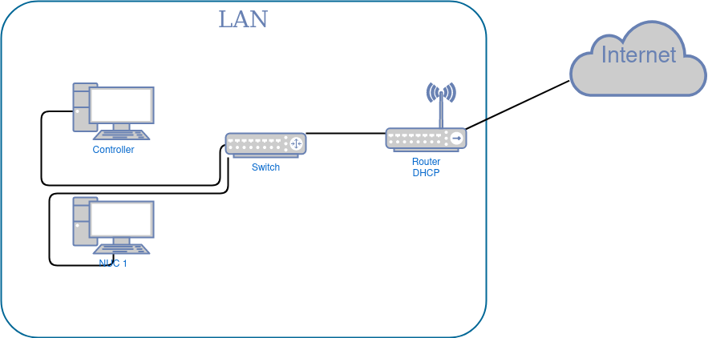

# Journey, Part 2: Operating System Installation

What is a lot more interesting is how the operating system will be delivered to the machine and with what information. As I mentioned in the introductory post, I will attempt to push as much of the provisioning to the image itself, so that at best none or at worst minimal work will be needed after operating system installation.

So what is *the machine*? The machine is a NUC, a stock personal computer. It will come preinstalled with a m.2 or SATA SSD. It will without doubt attempt to boot from that device when powered on. This opens up the possibility of extracting the SSD and using a control machine to preinstall an operating system. Now does that, literally, involve toil each time we need to install something.

I could just install the operating system like on any consumer PC using a USB flash drive with an install image. I could then prepare cloud-init configuration to pick things up after the first boot, or I could do nothing and provision using Configuration Managmement tooling. The more provisioning is done at the image preparation stage, though, the better. Another thing I really want to be possible is a USB flash drive which when booted runs `dd` on the internal drive with a prepared image.  Realistically, a portable linux distribution on a USB drive with a raw image copied along.

An alternative to the flash drive would be [PXE booting](https://en.wikipedia.org/wiki/Preboot_Execution_Environment).  This approach will take some prep. Whatever tooling we use the functionality we want is the following:

* We have boot images capable, ideally in an automated fashion, of installing an OS.
* There is a server serving the boot images over the network.
* There is a DHCP server capable of advertising above server.
* There is PXE boot support on the client. All the NUCs I purchased do, or at least say they do.

I am confident that the server parts can be initially ran from a control machine and eventually bootstrapped into the cluster like any other workload. This means the control machine could only be needed for the initial installations. This would introduce an *interesting* cycle: The provisioning of the core workload orchestration system will depend on the workload orchestration system itself.  We'll have to see about what the state of the PXE management system we choose looks like, but one thing is for sure: we'll be taking backups.

Here is some interesting links that look relevant to my use-case:

PXE-based bare-metal provisioning:
* [netboot.xyz self-hosted](https://netboot.xyz/docs/selfhosting). Can install provided images with
  its self-hosted option.
* [bofied](https://github.com/pojntfx/bofied). This is awesome. The required core functionality
  behind some nice UI.
* [MAAS](https://maas.io). MAAS supports cloud metadata. I love that.
* [tinkerbell](https://tinkerbell.org/). Uses container images, but it's pretty cool otherwise. We
  could use [this](https://artifacthub.io/packages/tbaction/tinkerbell-community/image2disk) to
  provide the image. It has a [terraform provider](https://registry.terraform.io/providers/tinkerbell/tinkerbell/latest/docs)!
* [matchbox](https://matchbox.psdn.io/). It's specialized to Fedora CoreOS and Flatcar Linux as it
  employs [ignition](https://github.com/coreos/ignition). It has a [terraform provider](https://registry.terraform.io/providers/poseidon/matchbox/latest/docs) as well!
* [pixiecore](https://github.com/danderson/netboot/tree/master/pixiecore)
* [ipxe](https://ipxe.org/)
* [puppetlabs razor](https://github.com/puppetlabs-toy-chest/razor-server/wiki)
* [cobbler](https://cobbler.readthedocs.io/en/latest/quickstart-guide.html)
* [rack HD](https://rackhd.github.io/)
* [digital\_rebar](https://rackn.com/rebar/)
* [the foreman](https://theforeman.org/)
* [FOG Project](https://fogproject.org/)

Relevant to bare-metal provisioning:
* [awesome-baremetal](https://github.com/alexellis/awesome-baremetal)
* [ubuntu autoinstall](https://ubuntu.com/server/docs/install/autoinstall)
* [ovh blog on provisioning](https://blog.ovhcloud.com/how-do-we-deploy-cloud-ready-images-on-bare-metal-servers/)
* [cloud-init with MAAS](https://discourse.maas.io/t/customizing-maas-deployments-with-cloud-init/165)


## Deciding on the provisioning approach

PXE booting with some management software is by far the more exciting option. Probably the most overkill as well, but we're not going for simplicity here! We're going for adventure!  ..within reason, ofcourse!

Before writing this article the extent of my knowledge was that I knew that network booting was a thing. I think (hope) I now have some idea of how the ecosystem looks like.

The hardware arrives tomorrow, so I have to sieve the tooling quickly. I'm probably doing a disservice to everything else, but I'm going to limit to the tooling that both has easily digestible documentation and has terraform providers available. I want to have as much of the configuration defined as code as possible. Not for the sake of it, but for the reproducibility it can offer.

Out of *matchbox* and *tinkerbell*, the first is quite constrained in what it can do but feels like it's going to be easier to wrangle, whereas the second takes the microservice approach making it potentially more complicated to manage but can pretty much do exactly what we want with the `image2disk` plugin.

Given my limited time, and although *matchbox* looks like a pleasure to toy with, I'm going to go with *tinkerbell*. It's the tool that can definitely work all four steps we described.

## Testing out the provisioning approach

Our immediate goal will be getting one of the machines to PXE boot.

Our network looks like this:



We'll be following the [on bare-metal with docker](https://docs.tinkerbell.org/setup/on-bare-metal-with-docker/) tinkerbell guide. No, that's irrelevant to the state of the repo. Cloning the repo and following the markdown guide for docker-compose.

Tinkerbell wants a static IP. Tinkerbell will not have a static IP for now.

```bash
❱ export TINKERBELL_HOST=192.168.1.55
❱ export TINKERBELL_CLIENT_IP=192.168.1.54
❱ export TINKERBELL_CLIENT_MAC=68:xx:xx:xx:xx:xx
❱ cd deploy/compose
❱ docker-compose up -d
ERROR: The Compose file './docker-compose.yml' is invalid because:
services.osie-bootloader.depends_on.osie-work.condition contains "service_completed_successfully",
which is an invalid type, it should be a service_started, or a service_healthy
services.tink-server.depends_on.tls-gen.condition contains "service_completed_successfully", which
is an invalid type, it should be a service_started, or a service_healthy
services.registry.depends_on.tls-gen.condition contains "service_completed_successfully", which is
an invalid type, it should be a service_started, or a service_healthy
```

..Isn't that a great start?

One part of the problem in our case is the fact that the stack wants the docker registry and the tink server to use tls.  and the keys are generated using clouflare's excellent cfssl tool, in another container.

The engineer's intention was that the certs get generated, the container exits, and the services start with the keys ready at their disposal.  The error is probably that my docker version is too old or too new, I can't find the keyword in the [3.x](https://docs.docker.com/compose/compose-file/compose-file-v3/) or [2.x](https://docs.docker.com/compose/compose-file/compose-file-v2/) compose-file documentation.

Looks like the stack will have to be crashing for a while cfssl does its thing.

The other part is that the nginx wants a couple of containers, namely `osie-work` and `ubuntu-image-setup` to complete before booting. We'll find out if this is an issue.

The set of changes comparing to the main branch is the following:

```git
❱ diff --git a/deploy/compose/docker-compose.yml b/deploy/compose/docker-compose.yml
index f99fdc5..dafeca2 100644
--- a/deploy/compose/docker-compose.yml
+++ b/deploy/compose/docker-compose.yml
@@ -127,8 +127,6 @@ services:
         condition: service_started
       db:
         condition: service_healthy
-      tls-gen:
-        condition: service_completed_successfully
     healthcheck:
       test: ["CMD-SHELL", "wget -qO- 127.0.0.1:42114/cert"] # port needs to match TINKERBELL_HTTP_AUTHORITY
       interval: 5s
@@ -231,10 +229,8 @@ services:
       - certs:/certs/${FACILITY:-onprem}:ro
       - auth:/auth:rw
     depends_on:
-      tls-gen:
-        condition: service_completed_successfully
-      registry-auth:
-        condition: service_completed_successfully
 
   boots:
     image: ${BOOTS_SERVER_IMAGE}
@@ -287,11 +283,6 @@ services:
       - 8080:80/tcp
     volumes:
       - ${REPO_TOP_LEVEL:-.}/state/webroot:/usr/share/nginx/html/
-    depends_on:
-      osie-work:
-        condition: service_completed_successfully
-      ubuntu-image-setup:
-        condition: service_completed_successfully
 
   hegel:
     image: ${HEGEL_SERVER_IMAGE}
```

And, just to be safe, I checked out to the `v0.6.0` tag and verified that the `service_completed_successfully` stuff is present.

Bunch of race errors, also stuff still breaking as the environment variables in the guide were replaced with a hidden `.env` file colocated with `docker-compose.yml`.  Let's edit the variables there and go.

All fine second time, issuing `docker-compose logs -f`.

Looks like any request to `boots` has a certificate error since the cert was issued for the previous IP. The script refuses to re-run, so we'll have to remove the certs manually. Since the volumes are compose volumes, we can locate them in `/var/lib/docker/compose_NAME/_data/`.

```bash
root@tile:/var/lib/docker/volumes/compose_certs/_data# rm *.pem
```

Good riddance. One `docker-compose up tls-gen` later, the new certs are in.  But there are still lingering erroneous certs with the default IP being passed around, grpc this time.

```bash
discover from dhcp message: get hardware by mac from tink: rpc error: code = Unavailable desc =
connection error: desc = \"transport: authentication handshake failed: x509: certificate is valid
for 192.168.56.4, 127.0.0.1, not 192.168.1.55\""
```

Let's go with `docker-compose down -v` removing all state.  Then back up to spawn the initial scripts, one more down and up to properly bring the services and it's running.

Rebooting the mini-pc into PXE launches it proper. It then loads `linuxkit` and hangs. The registry has some interesting logs:

```bash
registry_1                  | time="2022-01-05T22:27:20.556518731Z" level=error msg="response
completed with error" auth.user.name=admin err.code="blob unknown"
err.detail=sha256:f8934b6b4eace8f4d7592462941541deffffbd57f138d6fc3c5c5372266b6819 err.message="blob
unknown to registry"
```

Spawning the `tink-cli` container and issuing some commands reflects the hanged state:

```bash
❱ docker-compose exec tink-cli sh
# tink workflow get
Flag based client configuration failed with err: fetch cert: Get "http://127.0.0.1:42114/cert": dial
tcp 127.0.0.1:42114: connect: connection refused. Trying with env var legacy
method...
+--------------------------------------+--------------------------------------+---------------+----------------------+----------------------+
| ID                                   | TEMPLATE ID                          | STATE         |
CREATED AT           | UPDATED AT           |
+--------------------------------------+--------------------------------------+---------------+----------------------+----------------------+
| 51af991b-6e76-11ec-ac82-0242ac140004 | 519dd4c6-6e76-11ec-ac82-0242ac140004 | STATE_PENDING |
2022-01-05T22:24:59Z | 2022-01-05T22:24:59Z |
+--------------------------------------+--------------------------------------+---------------+----------------------+----------------------+
```

It seems like the tinkerbell worker images (both `hook` and `OSIE`) are not working right with my hardware. I can't even get my keyboard to use the console directly.

## Next steps

All this time would be better spent with a custom solution PXE-booting into an installer with whatever stock configuration the installer provides to get something working, and then using cloud-init to start things up. But this is what I realize after the fact, ofcourse.

Having failed miserably with Tinkerbell, I installed Ubuntu Server with a USB stick. The installer apparently can fetch your ssh keys from your github username, not bad. Set up static IPs manually and good to go.

There is **a lot** of software to explore in this space. I think I'll work on it again when I don't feel pressured to move forward with the more exciting stuff!
